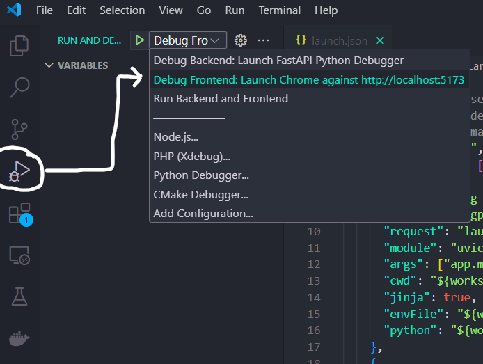
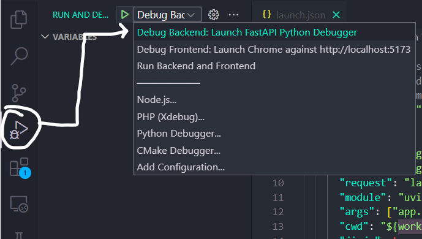

# FastAPI Project - Development

## Development in `localhost` with a custom domain

You might want to use something different than `localhost` as the domain. For example, if you are having problems with cookies that need a subdomain, and Chrome is not allowing you to use `localhost`.

In that case, you have two options: you could use the instructions to modify your system `hosts` file with the instructions below in **Development with a custom IP** or you can just use `localhost.tiangolo.com`, it is set up to point to `localhost` (to the IP `127.0.0.1`) and all its subdomains too. And as it is an actual domain, the browsers will store the cookies you set during development, etc.

If you used the default CORS enabled domains while generating the project, `localhost.tiangolo.com` was configured to be allowed. If you didn't, you will need to add it to the list in the variable `BACKEND_CORS_ORIGINS` in the `.env` file.

To configure it in your stack, follow the section **Change the development "domain"** below, using the domain `localhost.tiangolo.com`.

After performing those steps you should be able to open: http://localhost.tiangolo.com and it will be served by your stack in `localhost`.

Check all the corresponding available URLs in the section at the end.

## Development with a custom IP

If you are running Docker in an IP address different than `127.0.0.1` (`localhost`), you will need to perform some additional steps. That will be the case if you are running a custom Virtual Machine or your Docker is located in a different machine in your network.

In that case, you will need to use a fake local domain (`dev.example.com`) and make your computer think that the domain is served by the custom IP (e.g. `192.168.99.150`).

If you have a custom domain like that, you need to add it to the list in the variable `BACKEND_CORS_ORIGINS` in the `.env` file.

* Open your `hosts` file with administrative privileges using a text editor:

  * **Note for Windows**: If you are in Windows, open the main Windows menu, search for "notepad", right click on it, and select the option "open as Administrator" or similar. Then click the "File" menu, "Open file", go to the directory `c:\Windows\System32\Drivers\etc\`, select the option to show "All files" instead of only "Text (.txt) files", and open the `hosts` file.
  * **Note for Mac and Linux**: Your `hosts` file is probably located at `/etc/hosts`, you can edit it in a terminal running `sudo nano /etc/hosts`.

* Additional to the contents it might have, add a new line with the custom IP (e.g. `192.168.99.150`) a space character, and your fake local domain: `dev.example.com`.

The new line might look like:

```
192.168.99.150    dev.example.com
```

* Save the file.
  * **Note for Windows**: Make sure you save the file as "All files", without an extension of `.txt`. By default, Windows tries to add the extension. Make sure the file is saved as is, without extension.

...that will make your computer think that the fake local domain is served by that custom IP, and when you open that URL in your browser, it will talk directly to your locally running server when it is asked to go to `dev.example.com` and think that it is a remote server while it is actually running in your computer.

To configure it in your stack, follow the section **Change the development "domain"** below, using the domain `dev.example.com`.

After performing those steps you should be able to open: http://dev.example.com and it will be server by your stack in `192.168.99.150`.

Check all the corresponding available URLs in the section at the end.

## Change the development "domain"

If you need to use your local stack with a different domain than `localhost`, you need to make sure the domain you use points to the IP where your stack is set up.

To simplify your Docker Compose setup, for example, so that the API docs (Swagger UI) knows where is your API, you should let it know you are using that domain for development.

* Open the file located at `./.env`. It would have a line like:

```
DOMAIN=localhost
```

* Change it to the domain you are going to use, e.g.:

```
DOMAIN=localhost.tiangolo.com
```

That variable will be used by the Docker Compose files.

After that, you can restart your stack with:

```bash
docker compose up -d
```

and check all the corresponding available URLs in the section at the end.

## Docker Compose files and env vars

There is a main `docker-compose.yml` file with all the configurations that apply to the whole stack, it is used automatically by `docker compose`.

And there's also a `docker-compose.override.yml` with overrides for development, for example to mount the source code as a volume. It is used automatically by `docker compose` to apply overrides on top of `docker-compose.yml`.

These Docker Compose files use the `.env` file containing configurations to be injected as environment variables in the containers.

They also use some additional configurations taken from environment variables set in the scripts before calling the `docker compose` command.

## The .env file

The `.env` file is the one that contains all your configurations, generated keys and passwords, etc.

Depending on your workflow, you could want to exclude it from Git, for example if your project is public. In that case, you would have to make sure to set up a way for your CI tools to obtain it while building or deploying your project.

One way to do it could be to add each environment variable to your CI/CD system, and updating the `docker-compose.yml` file to read that specific env var instead of reading the `.env` file.

### Pre-commits and code linting

we are using a tool called [pre-commit](https://pre-commit.com/) for code linting and formatting.

When you install it, it runs right before making a commit in git. This way it ensures that the code is consistent and formatted even before it is committed.

You can find a file `.pre-commit-config.yaml` with configurations at the root of the project.

#### Install pre-commit to run automatically

`pre-commit` is already part of the dependencies of the project, but you could also install it globally if you prefer to, following [the official pre-commit docs](https://pre-commit.com/).

After having the `pre-commit` tool installed and available, you need to "install" it in the local repository, so that it runs automatically before each commit.

Using Poetry, you could do it with:

```bash
❯ poetry run pre-commit install
pre-commit installed at .git/hooks/pre-commit
```

Now whenever you try to commit, e.g. with:

```bash
git commit
```

...pre-commit will run and check and format the code you are about to commit, and will ask you to add that code (stage it) with git again before committing.

Then you can `git add` the modified/fixed files again and now you can commit.

#### Running pre-commit hooks manually

you can also run `pre-commit` manually on all the files, you can do it using Poetry with:

```bash
❯ poetry run pre-commit run --all-files
check for added large files..............................................Passed
check toml...............................................................Passed
check yaml...............................................................Passed
ruff.....................................................................Passed
ruff-format..............................................................Passed
eslint...................................................................Passed
prettier.................................................................Passed
```

## VS Code Debugging

### How to Run the Frontend Debugger

First, navigate to the `frontend` directory and install dependencies by running
```
npm install
```
After the dependencies are installed, you need to launch the frontend application by
```
npm run dev
``` 
With the application running, open the **Run and Debug** panel in Visual Studio Code and select **Debug Frontend** then green start button.




This will launch a Chrome browser pointing to `https://localhost:5173`


## How to Run the Backend Debugger

First, navigate to the `backend` directory. Begin by configuring Poetry to create virtual environment within the project folder.

Check installed poetry environment by running
```
poetry env info
```
This will list path to the virtual environment created by Poetry:
```
➜  backend git:(vscode-debug) ✗ poetry env info

Virtualenv
Python:         3.12.5
Implementation: CPython
Path:           /home/ilhanbae/.cache/pypoetry/virtualenvs/app-6zZbMuyK-py3.12
Executable:     /home/ilhanbae/.cache/pypoetry/virtualenvs/app-6zZbMuyK-py3.12/bin/python
Valid:          True

Base
Platform:   linux
OS:         posix
Python:     3.12.5
Path:       /home/linuxbrew/.linuxbrew/Cellar/python@3.12/3.12.5
Executable: /home/linuxbrew/.linuxbrew/Cellar/python@3.12/3.12.5/bin/python3.12
```

Now this virtual environment needs to be removed, because the path to this folder vary from machine and we need debugger to access these virtual environment in more consistent way. If you don't see any path listed under Virtualenv, you can skip this step.

So for my machine, I would do:
```
poetry env remove app-6zZbMuyK-py3.12
``` 

To create virtual environment within the project folder run the following in `backend` directory:

```
poetry config virtualenvs.in-project true
```

Then install all dependencies using:
```
poetry install
```

This will create `.venv` folder inside backend directory. You can also verify the virtual environment setup with 
```
poetry env info
```

One this setup is complete, open the **Run and Debug** panel in Visual Studio Code and select **Debug Backend** then green start button.



### How to Run Both Debuggers Simultaneously

To run both the frontend and backend debuggers at the same time, follow these steps:
1. Navigate to the `frontend` directory run `npm run dev` to start the frontend application.
2. Navigate to the `backend` directory and ensure the virtual environment is configured within the project folder
3. Open **Run and Debug** panel, and select **Run Backend and  Frontend**

## URLs

The production or staging URLs would use these same paths, but with your own domain.

### Development URLs

Development URLs, for local development.

Frontend: http://localhost

Backend: http://localhost/api/

Automatic Interactive Docs (Swagger UI): http://localhost/docs

Automatic Alternative Docs (ReDoc): http://localhost/redoc

Adminer: http://localhost:8080

Traefik UI: http://localhost:8090

### Development in localhost with a custom domain URLs

Development URLs, for local development.

Frontend: http://localhost.tiangolo.com

Backend: http://localhost.tiangolo.com/api/

Automatic Interactive Docs (Swagger UI): http://localhost.tiangolo.com/docs

Automatic Alternative Docs (ReDoc): http://localhost.tiangolo.com/redoc

Adminer: http://localhost.tiangolo.com:8080

Traefik UI: http://localhost.tiangolo.com:8090
